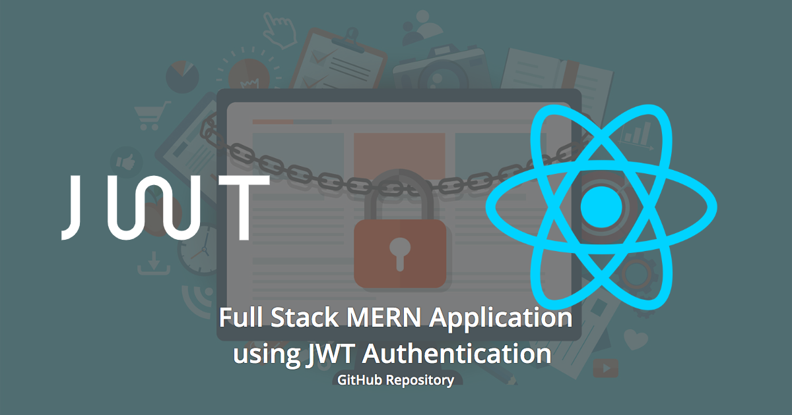

# Creating a Full Stack MERN Application using JWT Authentication



## Introduction

This repository contains the step by step procedure based on the commits to build the Full Stack MERN Application using JWT Authentication, which is described by the three parts article:

* [Creating a full-stack MERN app using JWT authentication: Part 1](https://blog.logrocket.com/mern-app-jwt-authentication-part-1/)
* [Creating a full-stack MERN app using JWT authentication: Part 2](https://blog.logrocket.com/mern-app-jwt-authentication-part-2/)
* Creating a full-stack MERN app using JWT authentication: Part 3

## Requirements

### System Requirements

You should be having these minimum requirements in your system to start working on the project.

* [Git](https://git-scm.com/)
* [Node.js](https://nodejs.org/)
* A supported browser like [Google Chrome](https://www.google.com/chrome/) or [Mozilla Firefox](https://www.mozilla.org/en-GB/firefox/new/)

### Development Requirements

If you are planning to contribute or recreate this repository, you should be having the following in your system to start the development.

* [Git](https://git-scm.com/)
* [Node.js](https://nodejs.org/)
* A supported browser like [Google Chrome](https://www.google.com/chrome/) or [Mozilla Firefox](https://www.mozilla.org/en-GB/firefox/new/)
* Code Editor supporting Babel like [Visual Studio Code](https://code.visualstudio.com/)
* [React Developer Tools](https://chrome.google.com/webstore/detail/react-developer-tools/fmkadmapgofadopljbjfkapdkoienihi?hl=en)

## Installation & Running

### Installation

First clone this repository to your local machine.

There are two parts in the repository, which you might need to run.

#### Server

To use the server, navigate to the `server` directory, install the dependencies using:

```bash
$ cd server
$ npm install
```

#### Client

To use the client, navigate to the `client` directory, install the dependencies using:

```bash
$ cd client
$ npm install
```

### Running the Application

You have to run two processes, each for the server and the client. Make sure you have two terminal processes running for the same.

#### Server

```bash
$ cd server
$ npm start
```

#### Client

```bash
$ cd client
$ npm start
```

If you need HTTPS in development, use:

```bash
$ cd client
$ HTTPS=true npm start
```

If you would like to run in production mode for the client, use:

```bash
$ cd client
$ PORT=80 npm run start:production
```

If you need HTTPS, use:

```bash
$ cd client
$ HTTPS=true PORT=443 npm run start:production
```

